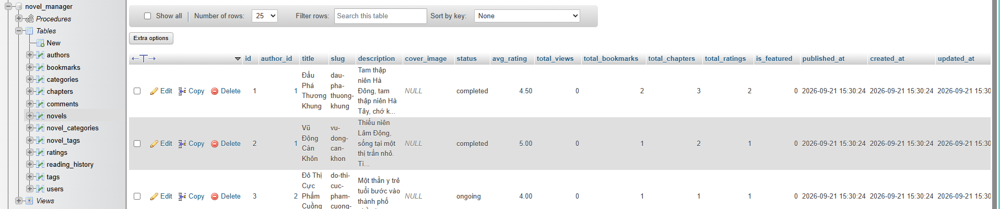

# BÁO CÁO BÀI TẬP NHÓM: PHÁT TRIỂN ỨNG DỤNG WEB NÂNG CAO
## Đề tài: Hệ Thống Quản Lý & Đọc Tiểu Thuyết (Novel Manager) - Nhóm 7

---

## 1. Thông Tin Nhóm & Link Repository

- **Link Git Repository của nhóm:** [https://github.com/Nhom7-N01-26/AdvancedWeb](https://github.com/Nhom7-N01-26/AdvancedWeb)
- **Học phần:** Phát triển ứng dụng Web nâng cao (Advanced Web)
- **Nhóm thực hiện:** Nhóm 7 (N01-26)

### Danh sách thành viên nhóm (Collaborators trên GitHub):
| STT | Họ và tên | GitHub Username / Email | Vai trò & Phân công nhiệm vụ |
|:---:|:---|:---|:---|
| 1 | **Lê Thanh Bình** (lebinh17) | `23010242@st.phenikaa-uni.edu.vn` | Thiết kế CSDL, tạo `.sql`, cấu hình `dbconnection.js`, CRUD Novels & Categories |
| 2 | **Trần Tiến Đức** (Elysia0533) | `23010777@st.phenikaa-uni.edu.vn` | Khởi tạo khung Express, định tuyến API, CRUD Users & Authors |
| 3 | **Nguyễn Tiến Hoàng Vũ** (hoangsfr) | `23010233@st.phenikaa-uni.edu.vn` | Cấu hình `.devcontainer`, Docker Compose, CRUD Chapters & Tags, viết tài liệu |

---

## 2. Cấu Trúc Repository

Repository được tổ chức chuẩn hóa đáp ứng 100% các tiêu chí nộp bài:

```text
AdvancedWeb/
├── .devcontainer/                  # [Yêu cầu 1] Môi trường chuẩn hóa DevContainer
│   ├── devcontainer.json           # File cấu hình DevContainer theo hướng dẫn của GV
│   └── docker-compose.yml          # Khởi chạy đồng thời Node.js app & MySQL 8.0
├── screenshots/                    # [Yêu cầu nộp] Thư mục chứa ảnh minh chứng
│   ├── cau3_database.png           # Ảnh chụp màn hình Hệ quản trị CSDL (Câu 3)
│   ├── cau4_dbconnection.png       # Ảnh chụp màn hình kết nối CSDL (Câu 4)
│   └── cau5_crud_postman.png       # Ảnh chụp màn hình test CRUD (Câu 5)
├── My-Node-Project/                # Mã nguồn ứng dụng Backend (Node.js & Express)
│   ├── src/
│   │   ├── controllers/            # [Yêu cầu 5] Các bộ điều khiển xử lý CRUD
│   │   │   ├── user.controller.js
│   │   │   ├── novel.controller.js
│   │   │   ├── category.controller.js
│   │   │   ├── author.controller.js
│   │   │   ├── chapter.controller.js
│   │   │   └── tag.controller.js
│   │   ├── routes/
│   │   │   └── api.routes.js       # Định tuyến RESTful API tập trung
│   │   └── entities/               # Model TypeScript entities
│   ├── dbconnection.js             # Kết nối CSDL dùng trong Express
│   ├── index.js                    # Server chính Express
│   ├── package.json
│   └── tsconfig.json
├── .env.example                    # File mẫu biến môi trường
├── .env                            # Cấu hình kết nối MySQL cục bộ
├── dbconnection.js                 # [Yêu cầu 4] File kiểm tra kết nối CSDL tại root
├── package.json                    # Package runner tại thư mục gốc
├── sql_nhom_7.sql                  # [Yêu cầu 2] File kịch bản CSDL đầy đủ
└── README.md                       # Báo cáo tổng hợp nộp bài
```

---

## 3. Nội Dung Trả Lời Các Yêu Cầu

### Yêu cầu 1: Môi trường chung phát triển ứng dụng (.devcontainer)
- Nhóm đã xây dựng môi trường phát triển chung bằng công nghệ **Development Containers (`.devcontainer`)** theo hướng dẫn tại [nglthu.github.io/.devcontainer/devcontainer_commandline](https://nglthu.github.io/.devcontainer/devcontainer_commandline).
- File [.devcontainer/devcontainer.json](.devcontainer/devcontainer.json) cấu hình:
  - Tự động nạp Docker Compose gồm môi trường Node.js 20 LTS và MySQL 8.0.
  - Tự động mount và nạp file `sql_nhom_7.sql` vào database khi container khởi chạy.
  - Forward các cổng: `3000` (Web API) và `3306` (MySQL Server).
  - Tích hợp sẵn các extension quan trọng: Prettier, ESLint, Database Client, REST Client.

---

### Yêu cầu 2: File Cơ Sở Dữ Liệu (`sql_nhom_7.sql`)
- File [sql_nhom_7.sql](sql_nhom_7.sql) tại thư mục gốc chứa toàn bộ kịch bản tạo CSDL `novel_manager`:
  - **11 Bảng dữ liệu:** `users`, `authors`, `categories`, `tags`, `novels`, `novel_categories`, `novel_tags`, `chapters`, `comments`, `ratings`, `bookmarks`, `reading_history`.
  - **Triggers tự động:** Cập nhật số lượng tiểu thuyết của tác giả, tổng số chương, điểm đánh giá trung bình (`avg_rating`), số lượt đánh dấu (`bookmarks`).
  - **Dữ liệu mẫu đầy đủ:** Đã nạp sẵn tài khoản Admin, Tác giả, Độc giả, danh mục thể loại và các tiểu thuyết nổi tiếng.

---

### Yêu cầu 3: Hệ Quản Trị Cơ Sở Dữ Liệu
- Hệ quản trị CSDL được sử dụng: **MySQL 8.0** (chạy qua Docker Container / MySQL Service / XAMPP).
- CSDL `novel_manager` đã được import thành công với bảng mã `utf8mb4_unicode_ci`.

#### Ảnh chụp màn hình Câu 3: Hệ quản trị CSDL


*Ghi chú: Ảnh hiển thị Hệ quản trị CSDL kết nối `localhost:3306`, quản lý database `novel_manager`, cây cấu trúc bảng và dữ liệu bảng `novels`.*

---

### Yêu cầu 4: File kết nối CSDL (`dbconnection.js`)
- File [dbconnection.js](dbconnection.js) được cài đặt bằng thư viện `mysql2/promise` với cơ chế Connection Pool hiệu năng cao.
- Có hàm `testConnection()` tự động kiểm tra kết nối, lấy phiên bản MySQL, tên database và in danh sách tất cả các bảng.
- Lệnh chạy kiểm tra độc lập:
  ```bash
  node dbconnection.js
  ```

#### Ảnh chụp màn hình Câu 4: Kết nối CSDL thành công


*Ghi chú: Ảnh chụp màn hình terminal thực thi `node dbconnection.js` với kết quả `[SUCCESS] Ket noi den CSDL MySQL (novel_manager) thanh cong!`.*

---

### Yêu cầu 5: Tạo CRUD cho từng đối tượng sinh viên
Nhóm đã triển khai đầy đủ các thao tác CRUD (Create - Read - Update - Delete) bằng chuẩn RESTful API cho các thực thể:

| Thực thể | Endpoint | Method | Mô tả chức năng |
|:---|:---|:---:|:---|
| **Users** | `/api/users` | `GET` | Lấy danh sách người dùng (lọc theo role, phân trang) |
| | `/api/users/:id` | `GET` | Xem chi tiết người dùng theo ID |
| | `/api/users` | `POST` | Thêm người dùng mới |
| | `/api/users/:id` | `PUT` | Cập nhật thông tin người dùng |
| | `/api/users/:id` | `DELETE` | Xóa người dùng |
| **Novels** | `/api/novels` | `GET` | Lấy danh sách tiểu thuyết (tìm kiếm theo tên, thể loại) |
| | `/api/novels/:id` | `GET` | Chi tiết tiểu thuyết kèm chương mới và danh mục |
| | `/api/novels` | `POST` | Đăng tải tiểu thuyết mới |
| | `/api/novels/:id` | `PUT` | Cập nhật thông tin tiểu thuyết |
| | `/api/novels/:id` | `DELETE` | Xóa tiểu thuyết |
| **Categories** | `/api/categories` | `GET`, `POST`, `PUT`, `DELETE` | Quản lý danh mục thể loại |
| **Authors** | `/api/authors` | `GET`, `POST`, `PUT`, `DELETE` | Quản lý hồ sơ tác giả |
| **Chapters** | `/api/chapters` | `GET`, `POST`, `PUT`, `DELETE` | Quản lý nội dung chương truyện |
| **Tags** | `/api/tags` | `GET`, `POST`, `PUT`, `DELETE` | Quản lý thẻ nhãn |

#### Ảnh chụp màn hình Câu 5: Kiểm thử CRUD qua Postman


*Ghi chú: Ảnh chụp màn hình giao diện Postman kiểm thử các thao tác CRUD (POST tạo mới, GET danh sách tiểu thuyết với status `200 OK`).*

---

## 4. Hướng Dẫn Cài Đặt & Khởi Chạy

### Cách 1: Sử dụng DevContainer (Khuyên dùng - Đạt chuẩn yêu cầu 1)
1. Mở thư mục dự án trong **VS Code**.
2. Khi VS Code hiển thị thông báo *"Reopen in Container"*, nhấn chọn để mở.
3. Hoặc nhấn `F1` -> chọn `Dev Containers: Reopen in Container`.
4. Môi trường Node.js và MySQL CSDL sẽ tự động được khởi tạo hoàn chỉnh.

### Cách 2: Khởi chạy trực tiếp (Local Machine)
1. **Cài đặt thư viện:**
   ```bash
   cd My-Node-Project
   npm install
   ```
2. **Cấu hình CSDL:**
   - Mở MySQL và import file `sql_nhom_7.sql`.
   - Cập nhật mật khẩu trong file `.env` (nếu có).
3. **Kiểm tra kết nối CSDL:**
   ```bash
   node dbconnection.js
   ```
4. **Khởi động Web API Server:**
   ```bash
   npm start
   ```
5. **Truy cập ứng dụng:**
   - Trang chủ & Danh mục API: [http://localhost:3000/](http://localhost:3000/)
   - Kiểm tra trạng thái hệ thống: [http://localhost:3000/health](http://localhost:3000/health)
   - Lấy danh sách tiểu thuyết: [http://localhost:3000/api/novels](http://localhost:3000/api/novels)
   - Lấy danh sách người dùng: [http://localhost:3000/api/users](http://localhost:3000/api/users)
