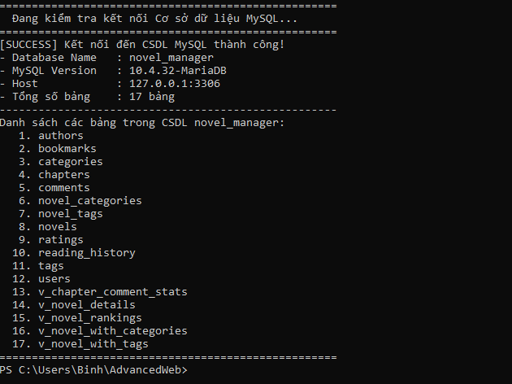
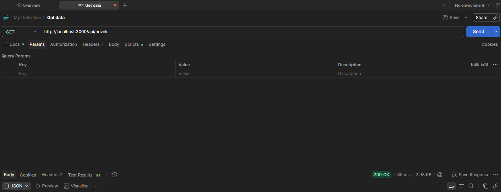

# BÁO CÁO BÀI TẬP NHÓM: XÂY DỰNG PHÁT TRIỂN ỨNG DỤNG WEB NÂNG CAO
## Đề tài: Hệ Thống Quản Lý & Đọc Tiểu Thuyết (Novel Manager) 
## Nhóm 7

---

## 1. Repository

- **Repository:** [https://github.com/Nhom7-N01-26/AdvancedWeb](https://github.com/Nhom7-N01-26/AdvancedWeb)

### Thành viên nhóm (Collaborators):
| STT | Họ và tên | GitHub Username / Email | Vai trò & Phân công nhiệm vụ |
|:---:|:---|:---|:---|
| 1 | **Lê Thanh Bình** (lebinh17) | `23010242@st.phenikaa-uni.edu.vn` | Thiết kế CSDL, tạo `.sql`, cấu hình `dbconnection.js`, CRUD Novels & Categories |
| 2 | **Trần Tiến Đức** (Elysia0533) | `23010777@st.phenikaa-uni.edu.vn` | Khởi tạo khung Express, định tuyến API, CRUD Users & Authors |
| 3 | **Nguyễn Tiến Hoàng Vũ** (hoangsfr) | `23010233@st.phenikaa-uni.edu.vn` | Cấu hình `.devcontainer`, Docker Compose, CRUD Chapters & Tags, viết tài liệu |

---

## 2. Cấu Trúc Repository

```text
AdvancedWeb/
├── .devcontainer/
│   ├── devcontainer.json
│   └── docker-compose.yml
├── screenshots/
│   ├── cau3_database.png
│   ├── cau4_dbconnection.png
│   └── cau5_crud_postman.png
├── My-Node-Project/
│   ├── src/
│   │   ├── controllers/
│   │   │   ├── user.controller.js
│   │   │   ├── novel.controller.js
│   │   │   ├── category.controller.js
│   │   │   ├── author.controller.js
│   │   │   ├── chapter.controller.js
│   │   │   └── tag.controller.js
│   │   ├── routes/
│   │   │   └── api.routes.js
│   │   └── entities/            
│   ├── dbconnection.js
│   ├── index.js
│   ├── package.json
│   └── tsconfig.json
├── .env.example
├── .env
├── dbconnection.js
├── package.json
├── sql_nhom_7.sql
└── README.md
```

---

## 3. Nội dung thực hiện

### 3.1. Môi trường phát triển

- Sử dụng **Development Containers** (`.devcontainer`).
- Sử dụng **Node.js 20 LTS** và **MySQL 8.0** chạy bằng Docker Compose.
- Tự động nạp file `sql_nhom_7.sql` khi khởi động.
- Forward port `3000` và `3306`.

### 3.2. Cơ sở dữ liệu

- File `sql_nhom_7.sql` tạo database `novel_manager`.
- Gồm **12 bảng**.
- Có **trigger cập nhật dữ liệu tự động**.
- Có **dữ liệu mẫu** để kiểm tra.

### 3.3. Hệ quản trị CSDL

- Hệ quản trị: **MySQL 8.0**
- Database: `novel_manager`
- Charset: `utf8mb4_unicode_ci`

### 3.4. Kết nối CSDL

File `dbconnection.js` sử dụng:

- `mysql2/promise`
- **Connection Pool**

Thực hiện kiểm tra:

- Phiên bản MySQL.
- Database đang sử dụng.
- Danh sách các bảng.

**Chạy kiểm tra:**

```bash
node dbconnection.js
```

#### Ảnh chụp màn hình 3.4: Kết nối CSDL thành công


*Ghi chú: Ảnh chụp màn hình terminal thực thi `node dbconnection.js` với kết quả `[SUCCESS] Ket noi den CSDL MySQL (novel_manager) thanh cong!`.*

---

### Tạo CRUD cho từng đối tượng sinh viên
Triển khai đầy đủ các thao tác CRUD (Create - Read - Update - Delete) bằng chuẩn RESTful API cho các thực thể:

| Thực thể | Endpoint | Method | Mô tả chức năng |
|:---|:---|:---:|:---|
| **Users** | `/api/users` | `GET` | Lấy danh sách người dùng (lọc theo role, phân trang) |
| | `/api/users/:id` | `GET` | Xem chi tiết người dùng theo ID |
| | `/api/users` | `POST` | Thêm người dùng mới |
| | `/api/users/:id` | `PUT` | Cập nhật thông tin người dùng |
| | `/api/users/:id` | `DELETE` | Xóa người dùng |
| **Novels** | `/api/novels` | `GET` | Lấy danh sách tiểu thuyết (tìm kiếm theo tên, thể loại) |
| | `/api/novels/:id` | `GET` | Chi tiết tiểu thuyết kèm chương mới và danh mục |
| | `/api/novels` | `POST` | Đăng tải tiểu thuyết mới |
| | `/api/novels/:id` | `PUT` | Cập nhật thông tin tiểu thuyết |
| | `/api/novels/:id` | `DELETE` | Xóa tiểu thuyết |
| **Categories** | `/api/categories` | `GET`, `POST`, `PUT`, `DELETE` | Quản lý danh mục thể loại |
| **Authors** | `/api/authors` | `GET`, `POST`, `PUT`, `DELETE` | Quản lý hồ sơ tác giả |
| **Chapters** | `/api/chapters` | `GET`, `POST`, `PUT`, `DELETE` | Quản lý nội dung chương truyện |
| **Tags** | `/api/tags` | `GET`, `POST`, `PUT`, `DELETE` | Quản lý thẻ nhãn |

#### Ảnh chụp màn hình: Kiểm thử CRUD qua Postman


*Ghi chú: Ảnh chụp màn hình giao diện Postman kiểm thử các thao tác CRUD (POST tạo mới, GET danh sách tiểu thuyết với status `200 OK`).*

---

## 4. Hướng Dẫn Cài Đặt & Khởi Chạy

### Cách 1: Sử dụng DevContainer (Khuyên dùng - Đạt chuẩn yêu cầu 1)
1. Mở thư mục dự án trong **VS Code**.
2. Khi VS Code hiển thị thông báo *"Reopen in Container"*, nhấn chọn để mở.
3. Hoặc nhấn `F1` -> chọn `Dev Containers: Reopen in Container`.
4. Môi trường Node.js và MySQL CSDL sẽ tự động được khởi tạo hoàn chỉnh.

### Cách 2: Khởi chạy trực tiếp (Local Machine)
1. **Cài đặt thư viện:**
   ```bash
   cd My-Node-Project
   npm install
   ```
2. **Cấu hình CSDL:**
   - Mở MySQL và import file `sql_nhom_7.sql`.
   - Cập nhật mật khẩu trong file `.env` (nếu có).
3. **Kiểm tra kết nối CSDL:**
   ```bash
   node dbconnection.js
   ```
4. **Khởi động Web API Server:**
   ```bash
   npm start
   ```
5. **Truy cập ứng dụng:**
   - Trang chủ & Danh mục API: [http://localhost:3000/](http://localhost:3000/)
   - Kiểm tra trạng thái hệ thống: [http://localhost:3000/health](http://localhost:3000/health)
   - Lấy danh sách tiểu thuyết: [http://localhost:3000/api/novels](http://localhost:3000/api/novels)
   - Lấy danh sách người dùng: [http://localhost:3000/api/users](http://localhost:3000/api/users)
