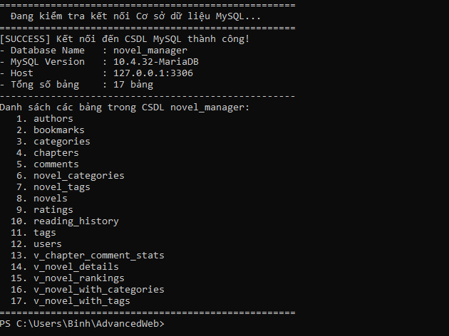
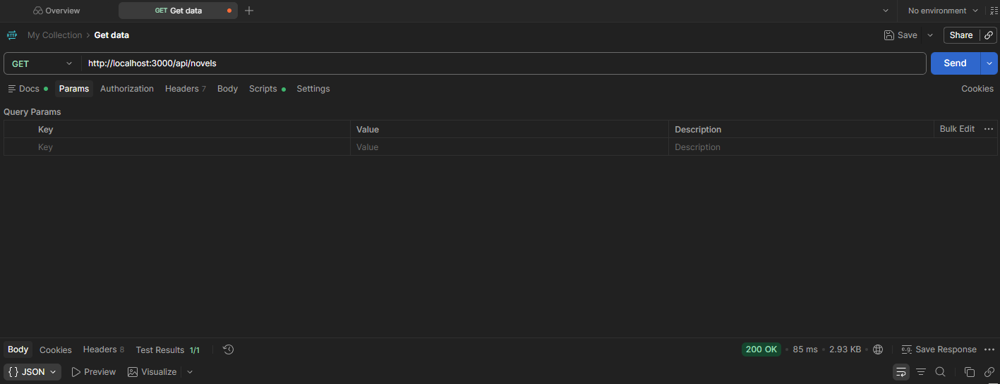

# BÁO CÁO BÀI TẬP NHÓM: XÂY DỰNG PHÁT TRIỂN ỨNG DỤNG WEB NÂNG CAO

## Đề tài: Hệ Thống Quản Lý & Đọc Tiểu Thuyết (Novel Manager)

## Nhóm 7

---

## 1. Repository

- **Repository:** [https://github.com/Nhom7-N01-26/AdvancedWeb](https://github.com/Nhom7-N01-26/AdvancedWeb)

### Thành viên nhóm (Collaborators):

| STT | Họ và tên                           | GitHub Username / Email           | Vai trò & Phân công nhiệm vụ                                                    |
| :-: | :---------------------------------- | :-------------------------------- | :------------------------------------------------------------------------------ |
|  1  | **Lê Thanh Bình** (lebinh17)        | `23010242@st.phenikaa-uni.edu.vn` | Thiết kế CSDL, tạo sql_nhom_7.sql, cấu hình dbconnection.js, CRUD Novels & Categories |
|  2  | **Trần Tiến Đức** (Elysia0533)      | `23010777@st.phenikaa-uni.edu.vn` | Khởi tạo Express, định tuyến API, CRUD Users & Authors |
|  3  | **Nguyễn Tiến Hoàng Vũ** (hoangsfr) | `23010233@st.phenikaa-uni.edu.vn` | 	DevContainer, CRUD Chapters & Tags, tài liệu |
|  4  | **Nguyễn Đức Hiếu** (...) | `23010726@st.phenikaa-uni.edu.vn` | WT Authentication, phân quyền Admin/Author, bảo vệ và kiểm thử API |

---

## 2. Cấu Trúc Repository

```text
AdvancedWeb/
├── .devcontainer/
│   ├── devcontainer.json
│   └── docker-compose.yml
├── screenshots/
│   ├── cau3_database.png
│   ├── cau4_dbconnection.png
│   └── cau5_crud_postman.png
├── My-Node-Project/
│   ├── src/
│   │   ├── controllers/
│   │   │   ├── user.controller.js
│   │   │   ├── novel.controller.js
│   │   │   ├── category.controller.js
│   │   │   ├── author.controller.js
│   │   │   ├── chapter.controller.js
│   │   │   └── tag.controller.js
│   │   ├── routes/
│   │   │   └── api.routes.js
│   │   └── entities/
│   ├── dbconnection.js
│   ├── index.js
│   ├── package.json
│   └── tsconfig.json
├── .env.example
├── .env
├── dbconnection.js
├── package.json
├── sql_nhom_7.sql
└── README.md
```

---

## 3. Nội dung thực hiện

### 3.1. Môi trường phát triển

- Sử dụng **Development Containers** (`.devcontainer`).
- Sử dụng **Node.js 20 LTS** và **MySQL 8.0** chạy bằng Docker Compose.
- Tự động nạp file `sql_nhom_7.sql` khi khởi động.
- Forward port `3000` và `3306`.

### 3.2. Cơ sở dữ liệu

- File `sql_nhom_7.sql` tạo database `novel_manager`.
- Gồm **12 bảng**.
- Có **trigger cập nhật dữ liệu tự động**.
- Có **dữ liệu mẫu** để kiểm tra.

### 3.3. Hệ quản trị CSDL

- Hệ quản trị: **MySQL 8.0**
- Database: `novel_manager`
- Charset: `utf8mb4_unicode_ci`

### 3.4. Kết nối CSDL

File `dbconnection.js` sử dụng:

- `mysql2/promise`
- **Connection Pool**

Thực hiện kiểm tra:

- Phiên bản MySQL.
- Database đang sử dụng.
- Danh sách các bảng.

**Chạy kiểm tra:**

```bash
node dbconnection.js
```

#### Ảnh chụp màn hình 3.4: Kết nối CSDL thành công



_Ghi chú: Ảnh chụp màn hình terminal thực thi `node dbconnection.js` với kết quả `[SUCCESS] Ket noi den CSDL MySQL (novel_manager) thanh cong!`._

---

### Tạo CRUD cho từng đối tượng sinh viên

Triển khai đầy đủ các thao tác CRUD (Create - Read - Update - Delete) bằng chuẩn RESTful API cho các thực thể:

| Thực thể       | Endpoint          |             Method             | Mô tả chức năng                                         |
| :------------- | :---------------- | :----------------------------: | :------------------------------------------------------ |
| **Users**      | `/api/users`      |             `GET`              | Lấy danh sách người dùng (lọc theo role, phân trang)    |
|                | `/api/users/:id`  |             `GET`              | Xem chi tiết người dùng theo ID                         |
|                | `/api/users`      |             `POST`             | Thêm người dùng mới                                     |
|                | `/api/users/:id`  |             `PUT`              | Cập nhật thông tin người dùng                           |
|                | `/api/users/:id`  |            `DELETE`            | Xóa người dùng                                          |
| **Novels**     | `/api/novels`     |             `GET`              | Lấy danh sách tiểu thuyết (tìm kiếm theo tên, thể loại) |
|                | `/api/novels/:id` |             `GET`              | Chi tiết tiểu thuyết kèm chương mới và danh mục         |
|                | `/api/novels`     |             `POST`             | Đăng tải tiểu thuyết mới                                |
|                | `/api/novels/:id` |             `PUT`              | Cập nhật thông tin tiểu thuyết                          |
|                | `/api/novels/:id` |            `DELETE`            | Xóa tiểu thuyết                                         |
| **Categories** | `/api/categories` | `GET`, `POST`, `PUT`, `DELETE` | Quản lý danh mục thể loại                               |
| **Authors**    | `/api/authors`    | `GET`, `POST`, `PUT`, `DELETE` | Quản lý hồ sơ tác giả                                   |
| **Chapters**   | `/api/chapters`   | `GET`, `POST`, `PUT`, `DELETE` | Quản lý nội dung chương truyện                          |
| **Tags**       | `/api/tags`       | `GET`, `POST`, `PUT`, `DELETE` | Quản lý thẻ nhãn                                        |

#### Ảnh chụp màn hình: Kiểm thử CRUD qua Postman



_Ghi chú: Ảnh chụp màn hình giao diện Postman kiểm thử các thao tác CRUD (POST tạo mới, GET danh sách tiểu thuyết với status `200 OK`)._

## 4. NestJS chuyển đổi

Thư mục `novel/` là implementation NestJS độc lập dùng TypeORM và `mysql2`. Express trong `My-Node-Project/` vẫn được giữ nguyên để tương thích ngược; hai ứng dụng dùng cùng database nhưng chạy khác port:

- Express: `3000`
- NestJS: `3001`

NestJS sử dụng `synchronize: false`, vì `sql_nhom_7.sql` là nguồn chuẩn của schema. Entity phản ánh 10 bảng hiện có, bao gồm quan hệ one-to-one, one-to-many, self-reference và many-to-many.

### Kiến trúc NestJS

```text
novel/src/
├── database/database.provider.ts
├── entities/                 # TypeORM entities theo SQL
├── users/ authors/ categories/
├── tags/ novels/ chapters/   # module + provider + service + controller + DTO
└── common/                   # validation/error helpers
```

Luồng xử lý là `Request -> Controller -> Service -> Repository provider -> TypeORM -> MySQL`. Class Diagram nằm tại [novel/docs/class-diagram.md](novel/docs/class-diagram.md), còn danh sách request kiểm thử nằm tại [novel/docs/api-test.md](novel/docs/api-test.md).

### Chạy NestJS

```bash
cd novel
npm install
npm run start:dev
```

API NestJS có prefix `/api`, ví dụ `GET http://localhost:3001/api/novels`. Biến môi trường được mô tả trong [.env.example](.env.example); không commit file `.env` thật.

---

Đây là bản sạch, không emoji, hợp để đưa thẳng vào README:

 README - Hướng Dẫn Cài Đặt & Khởi Chạy

## 5\. Hướng Dẫn Cài Đặt & Khởi Chạy

 ### Backend

 | Thư mục | Công nghệ | Mô tả |
| --- | --- | --- |
| `novel/` | NestJS | Backend chính |
| `My-Node-Project/` | Express | Backend cũ |

### Authentication

 Sử dụng JWT.

 - Đăng ký: `POST /api/auth/register`
- Đăng nhập: `POST /api/auth/login`
- API thay đổi dữ liệu: `Authorization: Bearer <token>`
- `admin`: toàn quyền
- `author`: quản lý novel/chapter của mình

 ### Cách 1: DevContainer

 Mở project bằng VS Code → chọn **Reopen in Container**.

 Node.js và MySQL được thiết lập sẵn.

 ### Cách 2: Chạy Local

 **1\. Cài đặt thư viện**

```
cd My-Node-Project
npm install
```

 **2\. Cấu hình MySQL**

 Import `sql_nhom_7.sql` vào MySQL và cập nhật `.env` nếu cần.

 **3\. Kiểm tra kết nối**

```
node dbconnection.js
```

 **4\. Khởi động server**

```
npm start
```

 ### API

 | Chức năng | URL |
| --- | --- |
| Trang chủ | `http://localhost:3000/` |
| Health Check | `http://localhost:3000/health` |
| Danh sách Novel | `http://localhost:3000/api/novels` |
| Danh sách User | `http://localhost:3000/api/users` |
