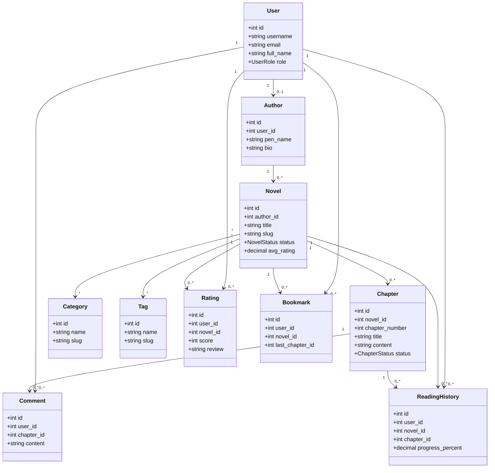

<p align="center">
  <a href="http://nestjs.com/" target="blank"></a>
</p>

[circleci-image]: https://img.shields.io/circleci/build/github/nestjs/nest/master?token=abc123def456
[circleci-url]: https://circleci.com/gh/nestjs/nest

  <p align="center">A progressive <a href="http://nodejs.org" target="_blank">Node.js</a> framework for building efficient and scalable server-side applications.</p>
    <p align="center">
<a href="https://www.npmjs.com/~nestjscore" target="_blank"></a>
<a href="https://www.npmjs.com/~nestjscore" target="_blank"></a>
<a href="https://www.npmjs.com/~nestjscore" target="_blank"></a>
<a href="https://circleci.com/gh/nestjs/nest" target="_blank"></a>
<a href="https://discord.gg/G7Qnnhy" target="_blank"></a>
<a href="https://opencollective.com/nest#backer" target="_blank"></a>
<a href="https://opencollective.com/nest#sponsor" target="_blank"></a>
  <a href="https://paypal.me/kamilmysliwiec" target="_blank"></a>
    <a href="https://opencollective.com/nest#sponsor"  target="_blank"></a>
  <a href="https://twitter.com/nestframework" target="_blank"></a>
</p>
  <!--[](https://opencollective.com/nest#backer)
  [](https://opencollective.com/nest#sponsor)-->

## Mô tả đề tài

Novel Manager là hệ thống quản lý và đọc truyện trực tuyến của Nhóm 7. Project
được chuyển đổi sang NestJS với TypeScript và TypeORM.

## Biểu đồ lớp

Biểu đồ lớp được phân tích trước khi xây dựng Entity, thể hiện các đối tượng,
thuộc tính và quan hệ chính của hệ thống.



## Cấu trúc NestJS

- Entity: [src/entities](src/entities)
- Module: [src/domain.module.ts](src/domain.module.ts)
- Controller: [src/novel.controller.ts](src/novel.controller.ts)
- Service: [src/novel.service.ts](src/novel.service.ts)
- Provider: [src/domain.providers.ts](src/domain.providers.ts)

Mỗi domain object đều có controller và service riêng: `User`, `Author`,
`Category`, `Tag`, `Novel`, `Chapter`, `Comment`, `Rating`, `Bookmark` và
`ReadingHistory`.

## API Novel

| Method | Endpoint      | Chức năng            |
| ------ | ------------- | -------------------- |
| GET    | `/novels`     | Lấy danh sách truyện |
| GET    | `/novels/:id` | Lấy truyện theo mã   |
| POST   | `/novels`     | Tạo truyện mới       |
| DELETE | `/novels/:id` | Xóa truyện           |

Các endpoint đọc và tạo tương tự được cung cấp cho `/users`, `/authors`,
`/categories`, `/tags` và `/chapters`.

## Project setup

```bash
$ npm install
```

## Compile and run the project

```bash
# development
$ npm run start

# watch mode
$ npm run start:dev

# production mode
$ npm run start:prod
```

## Run tests

```bash
# unit tests
$ npm run test

# e2e tests
$ npm run test:e2e

# test coverage
$ npm run test:cov
```

## Deployment

When you're ready to deploy your NestJS application to production, there are some key steps you can take to ensure it runs as efficiently as possible. Check out the [deployment documentation](https://docs.nestjs.com/deployment) for more information.

If you are looking for a cloud-based platform to deploy your NestJS application, check out [Mau](https://mau.nestjs.com), our official platform for deploying NestJS applications on AWS. Mau makes deployment straightforward and fast, requiring just a few simple steps:

```bash
$ npm install -g @nestjs/mau
$ mau deploy
```

With Mau, you can deploy your application in just a few clicks, allowing you to focus on building features rather than managing infrastructure.

## Observability

In production applications, observability is essential for understanding how your system behaves, detecting issues early, and maintaining reliable performance.

[NestJS Observe](https://observe.nestjs.com) automatically instruments your NestJS application, giving you deep visibility into your system with minimal setup:

- **Distributed tracing:** Follow requests across services and understand how they flow through your system.
- **Waterfall analysis:** Visualize request execution and identify slow operations, bottlenecks, and unexpected delays.
- **Performance analysis:** Analyze application performance in real time and quickly pinpoint areas that need optimization.
- **Metrics:** Track key application and infrastructure metrics to understand system health and performance trends.
- **Logging:** Centralize and correlate logs with traces and other telemetry to make debugging easier.
- **Error tracking:** Detect errors quickly and investigate their root causes with the surrounding context.
- **SLA monitoring:** Track service-level objectives and identify when your application is approaching or exceeding defined thresholds.
- **Alarms and alerts:** Set up alerts for critical errors, performance degradation, SLA violations, and other anomalies so your team can react quickly.

To add it to this project:

```bash
$ npm install @nestjs/observe
```

Then follow the [setup guide](https://docs.nestjs.com/observability/overview) - it takes a single import and an app key.

The free plan needs no payment details and covers 300,000 events a month. You can also browse the [live demo](https://www.observe-demo.nestjs.com/dashboard) first - the whole dashboard over a busy service's data, with nothing to install.

## Resources

Check out a few resources that may come in handy when working with NestJS:

- Visit the [NestJS Documentation](https://docs.nestjs.com) to learn more about the framework.
- For questions and support, please visit our [Discord channel](https://discord.gg/G7Qnnhy).
- To dive deeper and get more hands-on experience, check out our official video [courses](https://courses.nestjs.com/).
- Deploy your application to AWS with the help of [NestJS Mau](https://mau.nestjs.com) in just a few clicks.
- Auto-instrument your application with [NestJS Observe](https://observe.nestjs.com). Distributed tracing, metrics, and logging made easy. Error tracking and performance monitoring for your NestJS applications.
- Visualize your application graph and interact with the NestJS application in real-time using [NestJS Devtools](https://devtools.nestjs.com).
- Need help with your project (part-time to full-time)? Check out our official [enterprise support](https://enterprise.nestjs.com).
- To stay in the loop and get updates, follow us on [X](https://x.com/nestframework) and [LinkedIn](https://linkedin.com/company/nestjs).
- Looking for a job, or have a job to offer? Check out our official [Jobs board](https://jobs.nestjs.com).

## Support

Nest is an MIT-licensed open source project. It can grow thanks to the sponsors and support by the amazing backers. If you'd like to join them, please [read more here](https://docs.nestjs.com/support).

## Stay in touch

- Author - [Kamil Myśliwiec](https://twitter.com/kammysliwiec)
- Website - [https://nestjs.com](https://nestjs.com/)
- Twitter - [@nestframework](https://twitter.com/nestframework)

## License

Nest is [MIT licensed](https://github.com/nestjs/nest/blob/master/LICENSE).
