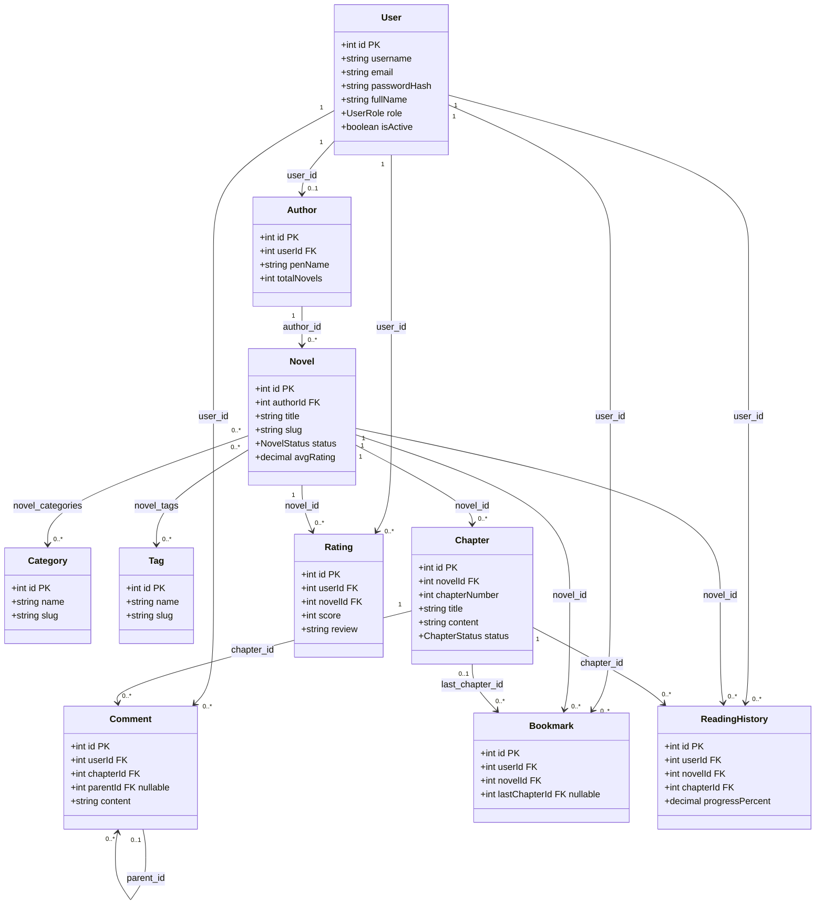

# Novel Manager Class Diagram

The diagram follows the tables and foreign keys declared in `sql_nhom_7.sql`.

`novel_categories` and `novel_tags` are represented as TypeORM many-to-many join tables. Decimal columns remain strings because MySQL drivers return exact decimals as strings.
